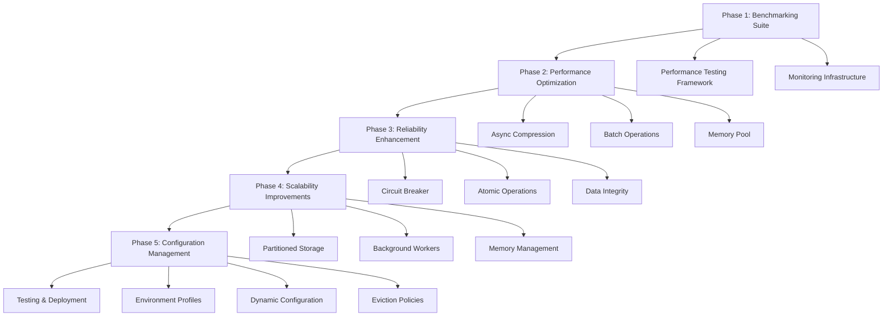

# Cache System Optimization Plan - Technical Specification

## 1. Product Overview

This document outlines a comprehensive optimization plan for the @lorm/core cache system to enhance performance, reliability, and scalability. The plan addresses current limitations through systematic improvements including async operations, reliability enhancements, and advanced configuration management.

The optimization targets improved cache hit rates (>80%), reduced response times (<10ms), enhanced reliability (99.9% uptime), and better scalability to handle 10x current load while maintaining backward compatibility.

## 2. Core Features

### 2.1 Feature Module

Our cache system optimization consists of the following main implementation phases:

1. **Performance Benchmarking Suite**: comprehensive testing framework, baseline metrics collection, performance monitoring infrastructure.
2. **Async Operations Enhancement**: streaming compression implementation, batch operations support, memory pool management.
3. **Reliability Improvements**: circuit breaker pattern, atomic file operations, checksum validation.
4. **Scalability Enhancements**: partitioned storage system, background cleanup workers, memory pressure detection.
5. **Configuration Management**: environment-specific profiles, dynamic configuration updates, configurable eviction policies.
6. **Testing & Monitoring**: comprehensive test suite, load testing framework, observability infrastructure.

### 2.2 Page Details

| Phase | Module Name | Feature description |
|-------|-------------|---------------------|
| Benchmarking Suite | Performance Testing Framework | Create comprehensive benchmarking tools for cache operations, memory usage tracking, I/O performance measurement, compression efficiency analysis |
| Benchmarking Suite | Monitoring Infrastructure | Implement performance metrics collection, operation timing tracking, memory pressure monitoring, error rate analysis |
| Async Operations | Streaming Compression | Replace synchronous compression with async streaming compression using Node.js streams, implement configurable compression levels |
| Async Operations | Batch Operations | Add batch get/set/delete operations to reduce I/O overhead, implement parallel processing for multiple cache operations |
| Async Operations | Memory Pool Management | Create object pooling for cache entries, implement memory-efficient data structures, add garbage collection optimization |
| Reliability | Circuit Breaker Pattern | Implement circuit breaker for file system operations, add failure detection and recovery mechanisms, provide graceful degradation |
| Reliability | Atomic Operations | Ensure atomic file writes using temporary files and rename operations, add transaction-like behavior for cache operations |
| Reliability | Data Integrity | Implement checksum validation for cache entries, add corruption detection and recovery, ensure data consistency |
| Scalability | Partitioned Storage | Split cache storage into multiple directories to avoid filesystem limits, implement hash-based partitioning strategy |
| Scalability | Background Workers | Move cleanup operations to background workers, implement non-blocking cache maintenance, add worker thread management |
| Scalability | Memory Management | Add memory pressure detection, implement adaptive eviction strategies, optimize memory usage patterns |
| Configuration | Environment Profiles | Create development, production, and testing configuration profiles, implement environment-specific cache settings |
| Configuration | Dynamic Updates | Allow runtime configuration changes, implement hot-reload for cache settings, add configuration validation |
| Configuration | Eviction Policies | Implement LRU, LFU, and FIFO eviction policies, add configurable policy selection, optimize eviction algorithms |

## 3. Core Process

### Implementation Flow

The optimization process follows a phased approach starting with establishing performance baselines, then implementing core performance improvements, followed by reliability enhancements, scalability improvements, and finally configuration management features.

**Phase 1 - Foundation (Weeks 1-2)**: Establish benchmarking suite and baseline metrics
**Phase 2 - Performance (Weeks 3-5)**: Implement async compression, batch operations, and memory pooling
**Phase 3 - Reliability (Weeks 6-8)**: Add circuit breakers, atomic operations, and data integrity checks
**Phase 4 - Scalability (Weeks 9-11)**: Implement partitioned storage, background workers, and memory management
**Phase 5 - Configuration (Weeks 12-13)**: Add environment profiles, dynamic configuration, and eviction policies

## 4. User Interface Design

### 4.1 Design Style

- **Primary Colors**: Terminal green (#00FF00) for success states, amber (#FFA500) for warnings, red (#FF0000) for errors
- **Code Style**: Monospace fonts (Consolas, Monaco) for code blocks and technical specifications
- **Layout Style**: Clean documentation format with clear section headers, code blocks, and structured tables
- **Icon Style**: Use technical symbols (⚡ for performance, 🔒 for security, 📊 for monitoring)

### 4.2 Page Design Overview

| Section | Module Name | UI Elements |
|---------|-------------|-------------|
| Benchmarking Suite | Performance Dashboard | Code blocks showing benchmark implementation, performance metrics tables, monitoring configuration examples |
| Async Operations | Implementation Guide | TypeScript code examples, async/await patterns, streaming API documentation |
| Reliability | Architecture Diagrams | Circuit breaker state diagrams, atomic operation flowcharts, error handling patterns |
| Scalability | System Design | Partitioning strategy diagrams, worker thread architecture, memory management visualizations |
| Configuration | Settings Reference | Configuration object examples, environment-specific tables, policy comparison charts |
| Testing | Test Strategy | Unit test examples, integration test patterns, load testing scenarios |

### 4.3 Responsiveness

This technical specification is designed as a comprehensive documentation format optimized for desktop viewing and development environments. The document structure supports both online viewing and offline reference with clear navigation and searchable content sections.
