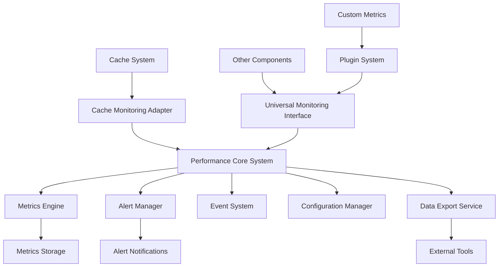

# Performance System Separation - Product Requirements Document

## 1. Product Overview

This document outlines the requirements for separating the performance monitoring system from the caching system in @lorm/core to achieve clear separation of concerns. The goal is to create a dedicated, reusable performance monitoring framework that can monitor any system component, not just caching operations.

The separation will improve modularity, reduce coupling between systems, enable independent scaling and optimization, and provide a foundation for comprehensive application performance monitoring across the entire @lorm ecosystem.

## 2. Core Features

### 2.1 User Roles

| Role | Registration Method | Core Permissions |
|------|---------------------|------------------|
| Developer | Direct API access | Can configure monitoring, view metrics, set up alerts |
| System Administrator | Configuration-based setup | Can manage global monitoring settings, export data, configure thresholds |
| Application User | Automatic integration | Receives performance insights through application interfaces |

### 2.2 Feature Module

Our performance system separation consists of the following main components:

1. **Performance Core Module**: standalone performance monitoring engine, metrics collection framework, alerting system.
2. **Cache Integration Layer**: lightweight adapter connecting cache operations to performance system, cache-specific metric definitions.
3. **Universal Monitoring Interface**: generic monitoring APIs for any system component, plugin architecture for custom metrics.
4. **Configuration Management**: environment-specific performance settings, dynamic threshold management, monitoring profiles.
5. **Data Export & Visualization**: metrics export capabilities, integration with external monitoring tools, performance dashboards.
6. **Testing & Validation**: performance system unit tests, integration testing framework, benchmark validation tools.

### 2.3 Page Details

| Component | Module Name | Feature description |
|-----------|-------------|---------------------|
| Performance Core | Metrics Engine | Collect, aggregate, and store performance metrics with configurable retention policies, support multiple metric types (counters, gauges, histograms) |
| Performance Core | Alert Manager | Monitor thresholds, trigger alerts, manage alert lifecycle with escalation policies and notification channels |
| Performance Core | Event System | Emit performance events, handle subscriptions, provide real-time monitoring capabilities with event filtering |
| Cache Integration | Monitoring Adapter | Instrument cache operations, translate cache events to performance metrics, maintain backward compatibility |
| Cache Integration | Cache Metrics | Define cache-specific performance indicators (hit rate, response time, memory usage), provide cache health scoring |
| Universal Interface | Plugin System | Register custom metric collectors, support third-party integrations, enable component-specific monitoring extensions |
| Universal Interface | Generic APIs | Provide standardized monitoring methods, support multiple programming paradigms, ensure type safety |
| Configuration | Profile Manager | Manage monitoring profiles for different environments, support hot-reloading of configurations, validate settings |
| Configuration | Threshold Engine | Dynamic threshold calculation, adaptive alerting based on historical data, support for complex threshold rules |
| Data Export | Export Service | Export metrics in multiple formats (JSON, CSV, Prometheus), support scheduled exports, provide data compression |
| Data Export | Visualization Tools | Generate performance reports, create monitoring dashboards, integrate with external visualization platforms |
| Testing | Unit Test Suite | Comprehensive test coverage for performance system, mock performance scenarios, validate metric accuracy |
| Testing | Integration Tests | Test performance system with real components, validate end-to-end monitoring workflows, performance regression testing |

## 3. Core Process

### System Architecture Flow

The performance system operates independently from the cache system while providing monitoring capabilities through well-defined interfaces. Components register with the performance system, which collects metrics, processes alerts, and provides data export capabilities.

**Initialization Flow**: Performance system starts → Components register monitoring interfaces → Metrics collection begins → Alert thresholds configured

**Monitoring Flow**: Component operations trigger events → Performance system captures metrics → Data aggregation and analysis → Alert evaluation → Notification dispatch

**Integration Flow**: Cache system implements monitoring interface → Performance adapter translates cache events → Generic performance metrics generated → Standard alerting and export available

## 4. User Interface Design

### 4.1 Design Style

- **Primary Colors**: Blue (#007ACC) for performance metrics, green (#28A745) for healthy states, orange (#FD7E14) for warnings, red (#DC3545) for critical alerts
- **Typography**: Monospace fonts (JetBrains Mono, Fira Code) for code and metrics, sans-serif (Inter, Roboto) for documentation
- **Layout Style**: Clean modular design with clear component separation, card-based metric displays, hierarchical navigation
- **Icon Style**: Modern outline icons for metrics (📊), alerts (🚨), configuration (⚙️), export (📤)

### 4.2 Page Design Overview

| Component | Module Name | UI Elements |
|-----------|-------------|-------------|
| Performance Core | Metrics Dashboard | Real-time metric displays with time-series charts, configurable refresh intervals, metric filtering and search |
| Performance Core | Alert Console | Alert status indicators, alert history timeline, escalation workflow visualization, notification settings |
| Cache Integration | Cache Monitor | Cache-specific metric widgets, performance comparison charts, cache health indicators |
| Universal Interface | Component Registry | Registered component list, monitoring status indicators, plugin management interface |
| Configuration | Settings Panel | Environment profile selector, threshold configuration forms, monitoring toggle switches |
| Data Export | Export Interface | Export format selection, scheduling options, download progress indicators, integration status |

### 4.3 Responsiveness

The performance system is designed as a backend service with API-first architecture, supporting both programmatic access and web-based dashboards. The system provides responsive monitoring interfaces that adapt to different screen sizes and usage contexts, from development environments to production monitoring dashboards.