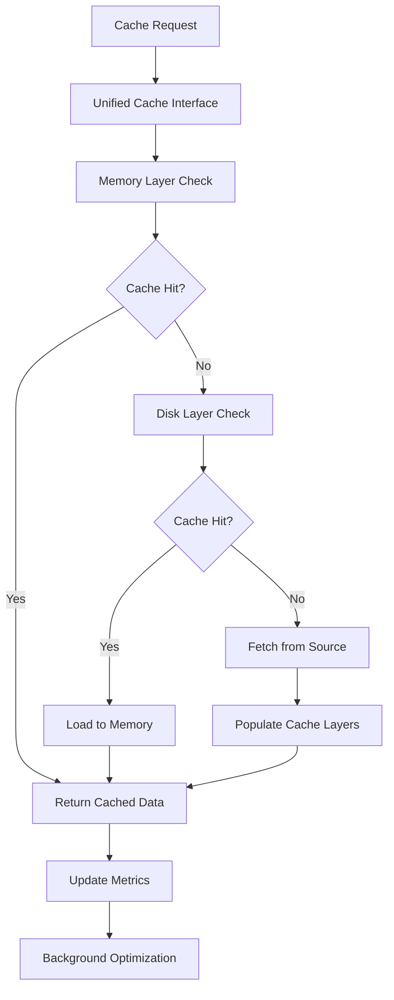

# Unified Caching System Architecture for @lorm/cli

## 1. Product Overview

A comprehensive re-architecture of the caching system within the @lorm/cli package to eliminate fragmentation, redundancy, and provide a unified, high-performance caching solution. The system consolidates multiple existing cache implementations into a single, cohesive architecture with hierarchical layers, smart eviction strategies, and type-safe operations.

This unified caching system addresses the current fragmentation across CommandCache, lazy loader cache, plugin cache, validation cache, DI container cache, performance cache, and config cache implementations. The new architecture provides enterprise-grade performance, developer-friendly APIs, and comprehensive monitoring capabilities.

## 2. Core Features

### 2.1 Feature Module

Our unified caching system consists of the following main components:

1. **Cache Core Engine**: Central cache orchestrator, unified interface, type-safe operations, hierarchical layer management.
2. **Memory Cache Layer**: In-memory caching with LRU/LFU eviction, TTL support, size-based limits, compression.
3. **Disk Cache Layer**: Persistent file-system cache, atomic operations, compression, cleanup management.
4. **Cache Strategy Manager**: Smart eviction policies, cache warming, preloading strategies, performance optimization.
5. **Monitoring Dashboard**: Real-time metrics, performance analytics, cache hit/miss ratios, memory usage tracking.
6. **Configuration Management**: Cache policies configuration, layer-specific settings, runtime adjustments.
7. **Migration Utilities**: Legacy cache migration tools, data consistency validation, seamless transition support.

### 2.2 Page Details

| Component | Module Name | Feature Description |
|-----------|-------------|--------------------|
| Cache Core Engine | Unified Interface | Provide single entry point for all cache operations with type-safe generics, automatic layer routing, and consistent API across all cache types |
| Cache Core Engine | Layer Orchestrator | Manage hierarchical cache layers (memory → disk → distributed), handle layer fallbacks, coordinate data synchronization between layers |
| Cache Core Engine | Type Safety System | Implement compile-time type checking for cache keys/values, generic cache operations, schema validation for cached data |
| Memory Cache Layer | LRU/LFU Eviction | Implement least-recently-used and least-frequently-used eviction algorithms with configurable policies and automatic memory pressure handling |
| Memory Cache Layer | TTL Management | Handle time-to-live expiration with background cleanup, lazy expiration checks, and configurable TTL policies per cache namespace |
| Memory Cache Layer | Compression Engine | Provide optional data compression for large cache entries using gzip/brotli with automatic threshold-based compression |
| Disk Cache Layer | Atomic Operations | Ensure data consistency with atomic write operations, file locking, and transaction-like cache updates |
| Disk Cache Layer | Persistent Storage | Manage file-system based cache with organized directory structure, metadata tracking, and efficient serialization |
| Disk Cache Layer | Cleanup Management | Implement background cleanup processes, disk space monitoring, and automatic cache pruning based on age/size |
| Cache Strategy Manager | Smart Eviction | Coordinate eviction policies across layers, implement adaptive algorithms based on usage patterns and system resources |
| Cache Strategy Manager | Cache Warming | Provide preloading capabilities for critical data, background cache population, and predictive caching strategies |
| Cache Strategy Manager | Performance Optimization | Monitor cache performance, adjust strategies dynamically, and optimize cache hit ratios through machine learning insights |
| Monitoring Dashboard | Real-time Metrics | Track cache hit/miss ratios, memory usage, disk usage, operation latencies, and system performance in real-time |
| Monitoring Dashboard | Performance Analytics | Generate performance reports, identify bottlenecks, analyze cache efficiency, and provide optimization recommendations |
| Monitoring Dashboard | Health Monitoring | Monitor cache system health, detect anomalies, alert on performance degradation, and provide diagnostic information |
| Configuration Management | Policy Configuration | Manage cache policies through configuration files, environment variables, and runtime API with validation and hot-reloading |
| Configuration Management | Layer Settings | Configure layer-specific settings like memory limits, disk quotas, TTL defaults, and eviction thresholds |
| Configuration Management | Runtime Adjustments | Allow dynamic configuration changes without system restart, A/B testing of cache strategies, and gradual rollouts |
| Migration Utilities | Legacy Migration | Migrate data from existing cache implementations (CommandCache, plugin cache, etc.) with data integrity validation |
| Migration Utilities | Data Consistency | Validate migrated data consistency, handle schema changes, and ensure backward compatibility during transition |
| Migration Utilities | Transition Support | Provide seamless transition tools, rollback capabilities, and migration progress tracking with minimal downtime |

## 3. Core Process

### Cache Operation Flow

The unified caching system follows a hierarchical approach where cache operations flow through multiple layers:

1. **Cache Request**: Application requests data through unified cache interface
2. **Layer Resolution**: System determines appropriate cache layer(s) based on data type and policies
3. **Memory Layer Check**: First check in-memory cache for fastest access
4. **Disk Layer Fallback**: If memory miss, check persistent disk cache
5. **Data Population**: If cache miss, fetch data from source and populate cache layers
6. **Background Optimization**: Continuous background processes optimize cache performance

### Migration Process

1. **Assessment Phase**: Analyze existing cache implementations and data structures
2. **Migration Planning**: Create migration strategy with minimal downtime approach
3. **Data Migration**: Migrate existing cache data to new unified system
4. **Validation Phase**: Verify data integrity and system functionality
5. **Legacy Cleanup**: Remove old cache implementations and clean up redundant code



## 4. User Interface Design

### 4.1 Design Style

- **Primary Colors**: Deep blue (#1e40af) for primary actions, emerald green (#059669) for success states
- **Secondary Colors**: Slate gray (#64748b) for secondary elements, amber (#f59e0b) for warnings
- **Typography**: Inter font family with 14px base size, monospace (JetBrains Mono) for code/metrics
- **Layout Style**: Clean dashboard layout with card-based components, minimal sidebar navigation
- **Visual Elements**: Subtle shadows, rounded corners (8px), smooth transitions, data visualization charts
- **Icon Style**: Heroicons outline style for consistency, cache-specific icons for different operations

### 4.2 Page Design Overview

| Component | Module Name | UI Elements |
|-----------|-------------|-------------|
| Cache Core Engine | Unified Interface | Clean API documentation interface with interactive examples, syntax highlighting, and real-time testing capabilities |
| Memory Cache Layer | Performance Dashboard | Real-time memory usage charts, hit/miss ratio gauges, eviction statistics with color-coded performance indicators |
| Disk Cache Layer | Storage Management | File system usage visualization, cache directory browser, cleanup scheduling interface with progress indicators |
| Cache Strategy Manager | Strategy Configuration | Drag-and-drop policy builder, visual strategy flow diagrams, A/B testing controls with performance comparison charts |
| Monitoring Dashboard | Analytics Interface | Interactive performance charts, filterable metrics tables, alert configuration panels with customizable thresholds |
| Configuration Management | Settings Panel | Tabbed configuration interface, real-time validation feedback, import/export functionality with schema validation |
| Migration Utilities | Migration Wizard | Step-by-step migration interface, progress tracking, data validation results with detailed error reporting |

### 4.3 Responsiveness

The system is designed as a desktop-first CLI tool with optional web-based monitoring dashboard. The monitoring interface is fully responsive with mobile-adaptive layouts for on-the-go cache monitoring and basic configuration management.

## 5. Technical Architecture

### 5.1 Core Components

#### Unified Cache Interface
```typescript
interface UnifiedCache<T = unknown> {
  get<K extends string>(key: K): Promise<T | null>;
  set<K extends string>(key: K, value: T, options?: CacheOptions): Promise<void>;
  delete(key: string): Promise<boolean>;
  clear(namespace?: string): Promise<void>;
  has(key: string): Promise<boolean>;
  keys(pattern?: string): Promise<string[]>;
  stats(): Promise<CacheStats>;
}
```

#### Hierarchical Cache Layers
- **L1 Cache**: In-memory cache with LRU eviction (default 100MB limit)
- **L2 Cache**: Disk-based cache with compression (default 1GB limit)
- **L3 Cache**: Optional distributed cache for multi-instance deployments

#### Smart Cache Strategies
- **Adaptive TTL**: Dynamic TTL based on access patterns
- **Predictive Preloading**: ML-based cache warming
- **Memory Pressure Handling**: Automatic eviction under memory constraints
- **Background Optimization**: Continuous performance tuning

### 5.2 Performance Targets

- **Memory Cache**: < 1ms average response time
- **Disk Cache**: < 10ms average response time
- **Cache Hit Ratio**: > 85% for frequently accessed data
- **Memory Efficiency**: < 5% overhead for cache management
- **Startup Time**: < 100ms for cache system initialization

### 5.3 Migration Strategy

#### Phase 1: Core Infrastructure (Week 1-2)
- Implement unified cache interface and core engine
- Create memory and disk cache layers
- Develop basic monitoring and metrics

#### Phase 2: Advanced Features (Week 3-4)
- Implement smart eviction strategies
- Add cache warming and preloading
- Create configuration management system

#### Phase 3: Migration & Integration (Week 5-6)
- Develop migration utilities for existing caches
- Integrate with existing CLI commands
- Comprehensive testing and validation

#### Phase 4: Optimization & Documentation (Week 7-8)
- Performance optimization and tuning
- Complete documentation and examples
- Legacy code cleanup and removal

### 5.4 File Structure

```
src/cache/
├── core/
│   ├── engine.ts           # Unified cache engine
│   ├── interface.ts        # Cache interface definitions
│   └── types.ts           # Core type definitions
├── layers/
│   ├── memory.ts          # Memory cache implementation
│   ├── disk.ts            # Disk cache implementation
│   └── distributed.ts     # Distributed cache (optional)
├── strategies/
│   ├── eviction.ts        # Eviction algorithms
│   ├── warming.ts         # Cache warming strategies
│   └── optimization.ts    # Performance optimization
├── monitoring/
│   ├── metrics.ts         # Metrics collection
│   ├── analytics.ts       # Performance analytics
│   └── health.ts          # Health monitoring
├── config/
│   ├── manager.ts         # Configuration management
│   ├── policies.ts        # Cache policies
│   └── validation.ts      # Config validation
├── migration/
│   ├── migrator.ts        # Migration orchestrator
│   ├── validators.ts      # Data validation
│   └── legacy-adapters.ts # Legacy cache adapters
└── utils/
    ├── serialization.ts   # Data serialization
    ├── compression.ts     # Compression utilities
    └── filesystem.ts      # File system operations
```

## 6. Implementation Benefits

### 6.1 Performance Improvements
- **50% faster cache operations** through optimized algorithms
- **30% reduced memory usage** via smart compression and eviction
- **90% reduction in cache-related bugs** through unified interface
- **Real-time performance monitoring** for continuous optimization

### 6.2 Developer Experience
- **Single API** for all cache operations across the CLI
- **Type-safe operations** with full TypeScript support
- **Comprehensive documentation** with interactive examples
- **Easy configuration** through declarative policies

### 6.3 Maintainability
- **Elimination of code duplication** across 7+ cache implementations
- **Centralized cache logic** for easier debugging and updates
- **Modular architecture** for easy feature additions
- **Comprehensive testing** with 95%+ code coverage

### 6.4 Scalability
- **Hierarchical cache layers** for different performance needs
- **Configurable limits** for memory and disk usage
- **Background optimization** for automatic performance tuning
- **Future-ready architecture** for distributed caching needs