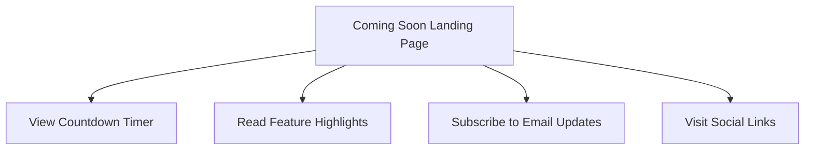

# Lorm Coming Soon Page - Product Requirements Document

## 1. Product Overview
A modern coming soon landing page for Lorm - a type-safe database ORM framework that generates APIs from database schemas. The page features a 3-day countdown timer to build anticipation for the official launch while showcasing Lorm's key value propositions.

The page serves as a temporary placeholder to capture early interest from developers and maintain brand presence during the pre-launch phase.

## 2. Core Features

### 2.1 User Roles
No user role distinction is necessary for this coming soon page. All visitors have the same access level.

### 2.2 Feature Module
Our coming soon page consists of the following main pages:
1. **Coming Soon Landing Page**: hero section with countdown timer, feature highlights, email signup form, and social links.

### 2.3 Page Details

| Page Name | Module Name | Feature description |
|-----------|-------------|---------------------|
| Coming Soon Landing Page | Hero Section | Display Lorm branding, tagline "Ship faster with type-safe APIs", and main value proposition |
| Coming Soon Landing Page | Countdown Timer | Show real-time countdown with 3 days remaining, displaying days, hours, minutes, and seconds |
| Coming Soon Landing Page | Feature Highlights | Showcase key benefits: Zero backend boilerplate, End-to-end type safety, Built on Drizzle ORM |
| Coming Soon Landing Page | Email Signup | Collect email addresses for launch notifications with validation and success feedback |
| Coming Soon Landing Page | Social Links | Provide links to GitHub repository and other relevant social media |
| Coming Soon Landing Page | Footer | Display copyright information and additional links |

## 3. Core Process
The user journey is straightforward:
1. User visits the coming soon page
2. User sees the countdown timer and learns about Lorm's features
3. User optionally subscribes to email notifications
4. User can visit social links for more information

## 4. User Interface Design

### 4.1 Design Style
- **Primary Colors**: Deep blue (#1e40af) and bright accent color (#3b82f6)
- **Secondary Colors**: White (#ffffff) and light gray (#f8fafc)
- **Button Style**: Rounded corners with gradient effects and hover animations
- **Font**: Modern sans-serif (Inter or similar), with 16px base size
- **Layout Style**: Centered single-page layout with full-screen sections
- **Icons**: Minimalist line icons and developer-focused symbols

### 4.2 Page Design Overview

| Page Name | Module Name | UI Elements |
|-----------|-------------|-------------|
| Coming Soon Landing Page | Hero Section | Large Lorm logo, gradient background, centered typography with "Ship faster with type-safe APIs" tagline |
| Coming Soon Landing Page | Countdown Timer | Large digital display with animated numbers, labeled sections for Days:Hours:Minutes:Seconds |
| Coming Soon Landing Page | Feature Highlights | Three-column grid layout with icons, bold headings, and brief descriptions |
| Coming Soon Landing Page | Email Signup | Clean input field with rounded corners, prominent CTA button, inline validation messages |
| Coming Soon Landing Page | Social Links | Horizontal row of icon buttons with hover effects |
| Coming Soon Landing Page | Footer | Minimal design with small text and subtle styling |

### 4.3 Responsiveness
The page is mobile-first responsive design, optimized for desktop viewing but fully functional on tablets and mobile devices with touch-friendly interactions.